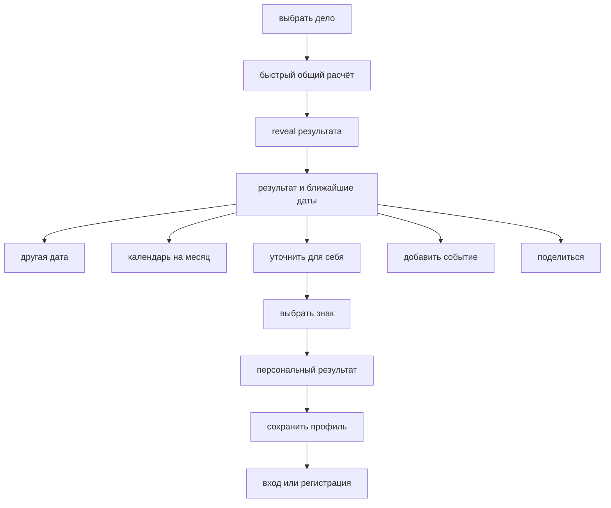

# Polune v2 — структура, флоу и контент для макетов

Статус: рабочая спецификация для обновления экранов в Figma. Публичную сборку пока не меняем.

## Главный принцип

Сервис сначала даёт полезный общий результат без регистрации. После результата пользователь может добровольно добавить персональные данные, открыть длинный календарь или сохранить профиль.



## Что отрисовать сейчас

Обязательные экраны ближайшей итерации:

1. стартовый экран;
2. каталог дел;
3. reveal нового результата;
4. общий результат;
5. выбранный не лучший день;
6. объяснение `как посчитали`;
7. календарь на месяц;
8. вход в персонализацию;
9. выбор знака;
10. персональный результат;
11. выбор способа добавления в календарь;
12. состояния ошибки и пустого поиска.

Расширенный ввод даты, времени и места рождения пока можно отрисовать как концепт, но не смешивать с основной v2 до появления персональной методики.

---

## Экран 1 — старт

### Задача

Сразу объяснить продукт и привести к выбору дела.

### Состав

- логотип;
- главный заголовок;
- выбранное или анимированно сменяющееся дело;
- короткая подсказка;
- одна основная кнопка;
- ссылки на методику и конфиденциальность остаются вторичными.

### Контент

```text
благоприятный день, чтобы

постричься

выберите дело или найдите его в каталоге

узнать день
```

В анимации примеров можно менять только вторую часть:

```text
постричься
начать новый уход
провести важный разговор
сделать большую уборку
начать учиться новому
выбрать своё дело
```

`выбрать своё дело` открывает каталог, но не обещает расчёт произвольной фразы.

---

## Экран 2 — каталог дел

### Заголовок

```text
выберите дело
```

### Подзаголовок

```text
начните искать или выберите из каталога
```

### Поиск

Placeholder:

```text
например, покрасить волосы
```

Инпут не получает фокус автоматически при открытии шторки.

### Группы

```text
часто выбирают
красота
забота о себе
дом
работа и учёба
общение и отношения
поездки
творчество
```

На первом посещении в `часто выбирают` находятся популярные дела. Позже группа может стать `недавние`.

### Пустой поиск

```text
пока такого дела нет

попробуйте другое слово или выберите похожее из каталога
```

Если запрос относится к рисковым темам:

```text
мы не рассчитываем даты для лечения и других важных решений

в таких вопросах лучше опираться на рекомендации специалистов и реальные обстоятельства
```

Не показываем действие `использовать свой текст`.

---

## Переход — reveal

Reveal запускается только после нового дела или явного персонального перерасчёта.

Текст во время короткого перехода:

```text
смотрим ритм ближайших дней
```

Не используем формулировки `спрашиваем у вселенной`, `звёзды решают` или искусственное долгое ожидание.

После переключения даты reveal не повторяется.

---

## Экран 3 — общий результат

### Верх экрана

```text
благоприятный день, чтобы

постричься
```

Рядом или ниже — спокойная подпись:

```text
общий расчёт без персональных данных
```

### Календарная полоса

- в области просмотра видно 7 дней;
- горизонтально доступны ближайшие 14 дней;
- цвет показывает абсолютный уровень совпадения;
- только один день получает отдельную отметку `лучший среди ближайших`;
- фиолетовый не используется как пятый уровень оценки.

### Главная карточка

Порядок контента:

```text
лучший среди ближайших

89% совпадение

24 августа, пн

день для мягкого обновления

освежите форму, не меняя себя целиком

как посчитали
```

`89%` означает индекс совпадения, а не вероятность удачной стрижки.

### Основные действия

```text
добавить событие

поделиться
```

### Персонализация

Небольшой самостоятельный блок после результата:

```text
сделать рекомендацию личнее

добавьте знак зодиака и посмотрите, изменится ли результат для вас

уточнить для себя
```

### Другие подходящие даты

Показываем две компактные строки, а не ещё две большие карточки:

```text
ещё подходящие дни

26 августа, ср · 84%
29 августа, сб · 79%
```

После них:

```text
открыть календарь
```

---

## Состояния результата

Контент должен меняться вместе с оценкой, а не повторять одинаковые три причины.

### Контентный контракт карточки

У любой выбранной даты один и тот же порядок информации:

```text
статус периода
оценка совпадения
дата
короткий человеческий вывод
практический совет по выбранному делу
как посчитали
```

Лунные параметры не заменяют вывод. Они раскрываются по `как посчитали`, а на первом уровне человек получает ответ именно про своё дело.

Примеры направления текста для разных групп:

| Группа | Человеческий вывод | Практический совет |
|---|---|---|
| красота | день для мягкого обновления | освежите форму, не меняя себя целиком |
| забота о себе | день для бережного старта | выберите нагрузку, которую сможете спокойно повторить |
| работа и учёба | день для собранного шага | закройте одну важную часть задачи вместо попытки сделать всё сразу |
| общение | разговор лучше вести прямо | заранее сформулируйте одну мысль, которую важно донести |
| дом | пространство легче привести в порядок | начните с одной заметной зоны и не растягивайте уборку на весь день |
| поездки | планы лучше закрепить заранее | проверьте детали маршрута и оставьте запас времени |

Это не готовые универсальные фразы на все даты. Для каждой группы нужны варианты под хороший, умеренный, нейтральный и низкий уровень совпадения.

### Лучший среди ближайших

```text
день для мягкого обновления

освежите форму, не меняя себя целиком
```

### Хороший день

```text
можно действовать уверенно

подойдёт для привычной стрижки или аккуратного обновления формы
```

### Умеренное совпадение

```text
лучше выбрать понятный вариант

день подходит для коррекции, но не требует резкой смены образа
```

### Нейтральный день

```text
день не мешает, но и не помогает

ориентируйтесь на удобное время и мастера, которому доверяете
```

### Низкое совпадение

```text
лучше не форсировать перемены

если можно, перенесите резкое обновление образа на более подходящий день
```

Формулировки не запрещают действие и не обещают результат.

---

## Экран 4 — пользователь выбрал другую дату

При нажатии на день в полосе:

- выделение календаря перемещается;
- одна карточка меняет дату, оценку, вердикт и совет;
- карточки не переставляются местами;
- reveal не запускается;
- ниже остаётся быстрый возврат к лучшему дню.

```text
вернуться к лучшему

24 августа, пн · 89%
```

Если выбран лучший день, вместо возврата показываются две альтернативы.

---

## Экран 5 — как посчитали

Лучше использовать отдельную шторку или страницу, а не маленький tooltip.

### Заголовок

```text
как посчитали
```

### Вводное сообщение

```text
это символическая подсказка, а не прогноз

оценка показывает, насколько день совпадает с правилами выбранного дела
```

### Факторы

Каждый фактор состоит из факта и перевода на обычный язык.

```text
фаза луны

растущая луна · фазовый угол 161°

эта фаза близка к профилю обновления и роста
```

```text
положение луны

луна в водолее

в нашей методике это поддерживает обновление и аккуратный эксперимент
```

```text
итог

89 из 100

день хорошо совпадает с правилами для дела «постричься»
```

Внизу:

```text
подробнее о методике
```

Для общего результата отдельно указываем:

```text
дата рождения пока не учитывается
```

---

## Экран 6 — календарь на месяц

Открывается по `открыть календарь` и не перегружает основной экран.

### Заголовок

```text
выберите дату
```

### Управление

- один месяц на экране;
- перелистывание вперёд и назад;
- горизонт до двух месяцев;
- выбранный день отмечен отдельно от цветовой оценки;
- лучший день месяца не подменяет ближайший лучший день без явного объяснения периода.

### Легенда

```text
хорошо подходит
умеренно подходит
нейтральный день
низкое совпадение
```

После выбора:

```text
посмотреть 12 сентября
```

Для бьюти‑дел можно подсказать:

```text
можно смотреть даты на два месяца вперёд
```

---

## Экран 7 — вход в персонализацию

Персонализация начинается после общего результата, а не до первой пользы.

### Контент

```text
сделать рекомендацию личнее

сейчас мы учитываем только дело и дату

добавьте свой знак, чтобы получить персональное уточнение

выбрать знак

не сейчас
```

Не пишем `повысить точность`, пока персональная методика не доказана и не описана.

---

## Экран 8 — выбор знака

### Заголовок

```text
кто вы по знаку
```

### Подсказка

```text
этого достаточно для быстрого персонального уточнения
```

Показываем сетку из 12 знаков. После выбора:

```text
уточнить результат
```

Вторичная ссылка для будущего сценария:

```text
указать дату рождения
```

Если человек не знает точное время рождения, это не должно блокировать сценарий.

---

## Экран 9 — персональный результат

Запускается короткий повторный reveal, потому что пользователь явно изменил расчёт.

Верхняя подпись:

```text
персональный расчёт · козерог
```

Если результат изменился:

```text
для вас ближе другая дата

26 августа лучше совпадает с выбранным делом и вашим персональным профилем
```

Если результат не изменился:

```text
лучший день не изменился

24 августа остаётся самым подходящим среди ближайших
```

Действия:

```text
добавить событие
сохранить профиль
```

Только `сохранить профиль` ведёт к входу или регистрации.

---

## Расширенные данные рождения — следующий слой

Этот флоу отрисовываем отдельно и помечаем как гипотезу:

```text
дата рождения

время рождения
не знаю точное время

место рождения
```

Правила:

- дата обязательна только внутри расширенного сценария;
- `не знаю точное время` включено по умолчанию;
- место показывается только если оно действительно используется методикой;
- пользователь видит, какие данные повлияли на расчёт;
- аккаунт предлагается после результата для сохранения данных.

---

## Добавление события

По кнопке открывается шторка:

```text
добавить событие

системный календарь
скачать файл события

google календарь
открыть готовое событие

скопировать дату
```

После создания `.ics` не пишем `добавлено`, пока событие фактически не появилось в календаре.

Корректный статус:

```text
файл события готов
```

Для Google Calendar:

```text
событие открыто в google календаре
```

---

## Шаринг

Шаринг использует тот же результат, а не случайную цитату.

Минимальный текст карточки:

```text
24 августа

мой день для мягкого обновления

хочу освежить форму, не меняя себя целиком

polune
```

Карточка может быть атмосфернее интерфейса, но её содержание должно совпадать с результатом на экране.

---

## Карта экранов для Figma

```text
00 start
01 intent catalog
02 intent catalog / search
03 intent catalog / empty
04 reveal / ready
05 reveal / opening
06 result / general / best
07 result / general / other date
08 methodology sheet
09 month calendar
10 personalization intro
11 zodiac selection
12 result / personalized / changed
13 result / personalized / unchanged
14 add to calendar sheet
15 share preview
16 error / calculation
17 error / unsupported topic
```

## Что пока не добавлять в основной флоу

- обязательную регистрацию до результата;
- обязательную дату рождения;
- время и место рождения без готовой методики;
- планировщик нескольких дел;
- медицинские и стоматологические сценарии;
- бесконечный AI‑ввод произвольной темы;
- случайное предсказание, не связанное с выбранным делом;
- отдельный фиолетовый уровень оценки;
- повторный reveal при каждом нажатии на дату.
